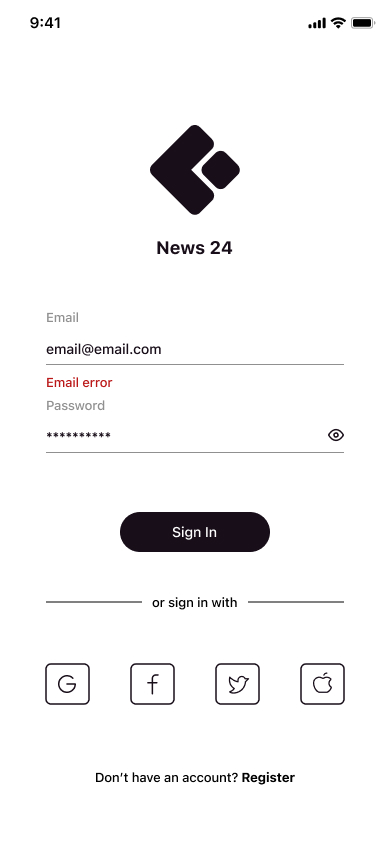
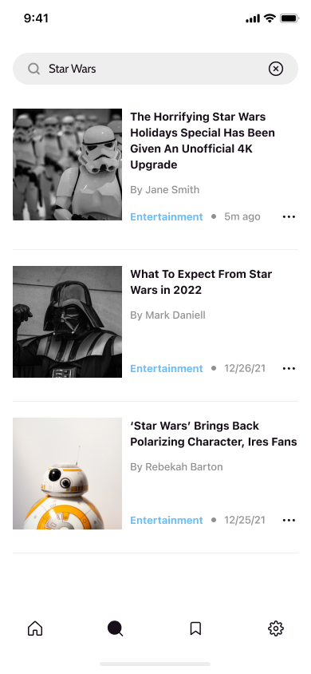
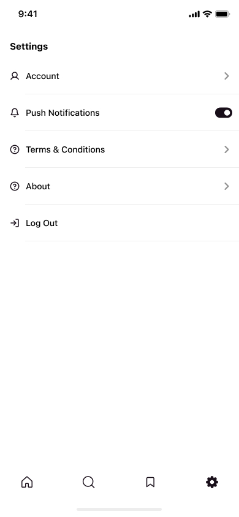

# newsly_app
For new news coverage, aggregated from sources all over the world

## pref
- Theme mode dark and light 
- realtime search 
- validation
- authentication
- animatin 
- pagination for infinity scroll articles
- good stracture 
- power by bloc state management
- share articles on other apps
- articles bookmark

## library i used 
- firebase 
- BLoC design pattern
- Bloc state management
- bloc concurrency
- web view
- Hive database
- Validation by formz
- Dio
- rxdart
- shimmer
- animation
- json_serializable


## Api
- **[mediastack api](https://mediastack.com/)** </br>
- **[Firebase Auth](https://firebase.google.com/)**

## Screens







## Folder structure 
```
lib
 ┣ core
 ┃ ┣ constants
 ┃ ┣ route
 ┃ ┣ theme
 ┃ ┗ core.dart
 ┣ data
 ┃ ┣ data_providers
 ┃ ┣ error
 ┃ ┣ models
 ┃ ┣ repositories
 ┃ ┗ data.dart
 ┣ logic
 ┃ ┣ bloc
 ┃ ┣ cubit
 ┃ ┗ debug
 ┃ ┃ ┣ app_bloc_observer.dart
 ┃ ┃ ┗ debug.dart
 ┣ presentation
 ┃ ┣ pages
 ┃ ┣ screens
 ┃ ┣ widgets
 ┃ ┣ initialize_app.dart
 ┃ ┣ news_app.dart
 ┃ ┗ presentation.dart
 ┣ generated_plugin_registrant.dart
 ┗ main.dart
 ```
